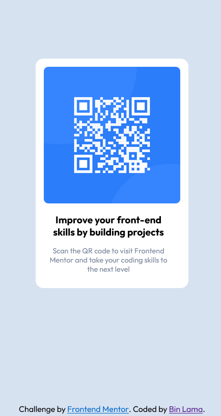

# Frontend Mentor - QR code component solution

This is a solution to the [QR code component challenge on Frontend Mentor](https://www.frontendmentor.io/challenges/qr-code-component-iux_sIO_H). Frontend Mentor challenges help you improve your coding skills by building realistic projects.

## Table of contents

-   [Overview](#overview)
    -   [Screenshot](#screenshot)
    -   [Links](#links)
-   [My process](#my-process)
    -   [Built with](#built-with)
    -   [What I learned](#what-i-learned)
-   [Author](#author)

**Note: Delete this note and update the table of contents based on what sections you keep.**

## Overview

Create a qr code displayer.

### Screenshot



### Links

-   Solution: [Solution URL](https://binlama.github.io/qr-code-component-main/)

## My process

-   I created the html lookout first while observing both desktop and mobile view.
-   Then, I started with styling the mobile view.
-   Since, mobile and desktop view were the same, I didn't change anything for the desktop view.

### Built with

-   Semantic HTML5 markup
-   CSS custom properties
-   Flexbox
-   Mobile-first workflow

### What I learned

I learned to use css variables. They made my code look more clean.
I also used non breaking space on html.

```css
:root {
    --DarkBlue: hsl(218, 44%, 2);
}
```

```html
<p>Challenge by&nbsp;</p>
```

## Author

-   Frontend Mentor - [@BinLama](https://www.frontendmentor.io/profile/BinLama)
